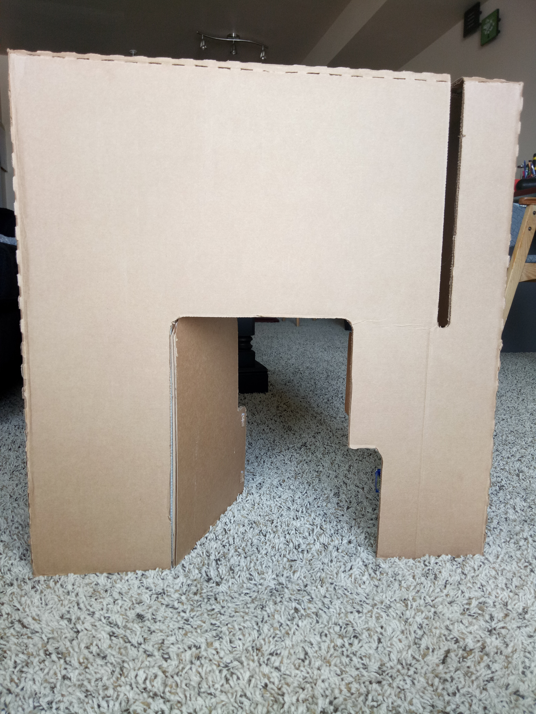
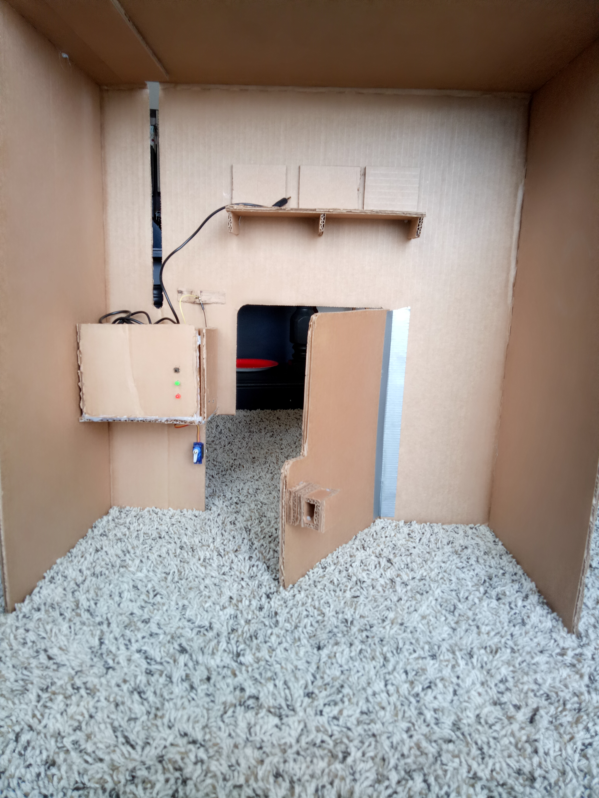

# CS207-Knock-Sensor-Lock
This repository explains how to build a Knock Sensor Lock using Arduino UNO.

# Introduction
This repository explains how to build a Knock Sensor Lock using an Arduino UNO. The lock system listens to the knocks on the door. If the knock matches, the servo motor unlockes the door; on the other hand, if the knock does not match, the servo motor does not turn an dkeeps the door locked. Every-time the door is unlocked, an audio recording is played to greet the user. This lock system system was installed on a cardboard house for demonstration purposes. The cardboard house has one entrance only, the main door. There are no other locks on the door other than the servo motor knock lock. The main door always remains locked and can only be unlocked by a secret knock. 

# Parts and Tools needed
1 x Arduino UNO  
1 x Piezo buzzer  
1 x 1MΩ resistor  
1 x Green LED  
1 x Red LED  
1 x Pushbutton  
25 x 560Ω resistors  
1 x 10kΩ resistor  
1 x servo motor  
4 x AA batteries  
1 x Breadboard  
Many assorted wires  
Some cardboard boxes  
Glue gun  
Soldering iron  
Battery-powered speaker  
Box cutter  
Computer to program the Arduino Board  

# Circuit Diagram

# Team
Harpinder Singh Minhas

# Credits
Steve Hoefer - Grathio Labs - Portion of the programming Code  
Alex James Clarke - University of Regina- Portion of programming code
